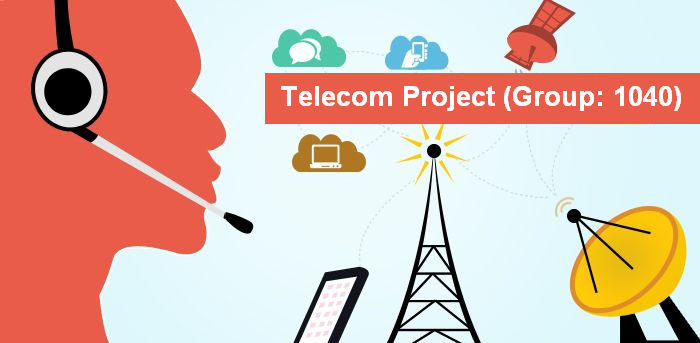

# Telecom-Capstone-Project

  

## About the project:

INSAID Telecom, one of the leading telecom players, understands that customizing offering is very important for its business to stay competitive.

Currently, INSAID Telecom is seeking to leverage behavioral data from more than 60% of the 50 million mobile devices active daily in India to help its clients better understand and interact with their audiences.

In this consulting project, we are expected to build a dashboard to understand user's demographic characteristics based on their mobile usage, geolocation, and mobile device properties.

This analysis report will help millions of developers and brand advertisers around the world pursue data-driven marketing efforts which are relevant to their users and catered to their preferences.

### This capstone prject is developed by team no: 1040 as part of our term assignemnt from INSAID.
